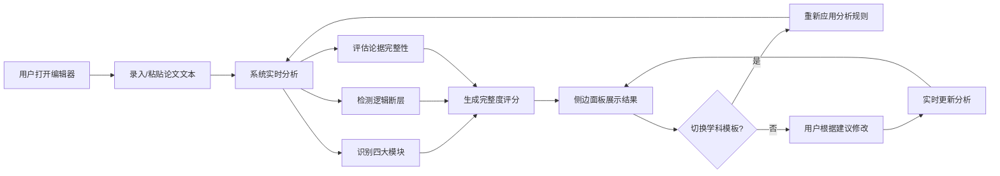

## 1. 产品概述

论文逻辑分析与框架优化平台，面向科研人员与学生，提供实验论文初稿的智能逻辑诊断服务。用户在可视化编辑界面录入论文初稿框架，系统自动识别四大模块、标记逻辑缺陷、提供增补建议，帮助快速构建结构严谨的学术论文。

## 2. 核心功能

### 2.1 用户角色

| 角色 | 注册方式 | 核心权限 |
|------|----------|----------|
| 科研用户 | 无需注册，直接使用 | 录入论文框架、查看分析结果、切换学科模板、导出建议 |

### 2.2 功能模块

1. **主编辑界面**：论文文本录入区、实时分析结果展示、模块标签可视化
2. **侧边分析面板**：完整度评分仪表盘、逻辑断层列表、论据缺失标记、框架增补建议
3. **学科模板切换**：理工类优化模板、生物类优化模板一键切换

### 2.3 页面详情

| 页面名称 | 模块名称 | 功能描述 |
|----------|----------|----------|
| 主编辑页 | 文本编辑器 | 支持大段文本输入、实时字数统计、自动保存草稿 |
| 主编辑页 | 模块识别可视化 | 自动高亮绪论、实验、数据、结论四大模块，可点击跳转 |
| 主编辑页 | 逻辑断层标记 | 红色波浪线标记逻辑断裂处，悬浮显示问题描述 |
| 侧边面板 | 完整度评分 | 环形仪表盘展示综合评分，细分为模块完整性、逻辑连贯性、论据充分度 |
| 侧边面板 | 学科模板切换 | 理工/生物模板切换按钮，实时更新分析规则与建议 |
| 侧边面板 | 优化建议列表 | 按优先级排列增补建议，支持一键采纳跳转 |

## 3. 核心流程

用户打开编辑页面 → 输入或粘贴论文初稿框架 → 系统实时进行模块识别与逻辑分析 → 侧边面板展示评分与问题列表 → 用户可切换学科模板调整分析维度 → 针对每个问题查看建议并修改文本 → 修改后实时更新分析结果 → 完成框架优化

## 4. 用户界面设计

### 4.1 设计风格

- **主色调**：深靛蓝 (#1a1f36) 作为背景主色，搭配科技感铜橙色 (#d4a574) 作为强调色
- **辅助色**：模块识别采用四色方案：绪论(蓝紫)、实验(青绿)、数据(琥珀)、结论(玫红)
- **按钮风格**：圆角矩形，微渐变填充，hover 时轻微上浮 + 发光效果
- **字体**：标题使用 Lora（衬线，学术感），正文使用 JetBrains Mono（等宽，代码感）
- **布局风格**：左右分栏式布局，左侧70%编辑区 + 右侧30%分析面板，顶部悬浮工具栏
- **视觉元素**：细微噪点纹理背景、发光边框、玻璃拟态面板、柔和阴影

### 4.2 页面设计概览

| 页面名称 | 模块名称 | UI 元素 |
|----------|----------|---------|
| 主编辑页 | 顶部工具栏 | Logo、模板切换器、字数统计、清空按钮 |
| 主编辑页 | 文本编辑区 | 大文本域、模块高亮背景、逻辑错误波浪线、行号 |
| 主编辑页 | 模块标签栏 | 四个彩色标签，显示各模块字数，点击跳转 |
| 侧边面板 | 评分仪表盘 | 环形进度图 + 分数数字，三项子评分条形图 |
| 侧边面板 | 问题列表 | 可折叠卡片，优先级标签，问题描述，建议文本，跳转按钮 |
| 侧边面板 | 模板切换区 | 两个卡片式切换按钮，当前选中高亮边框 |

### 4.3 响应式设计

采用桌面端优先设计，最小支持宽度 1280px。侧边面板可折叠为抽屉模式，在小屏幕下通过滑动手势呼出。

### 4.4 动效设计

- 页面加载：左侧编辑器渐入展开，右侧面板从右侧滑入
- 分析更新：评分数字滚动动画，问题列表项淡入
- 模块识别：高亮背景渐变色扩散动画
- 模板切换：交叉溶解过渡效果
- 按钮交互：微缩放 + 光晕扩散
