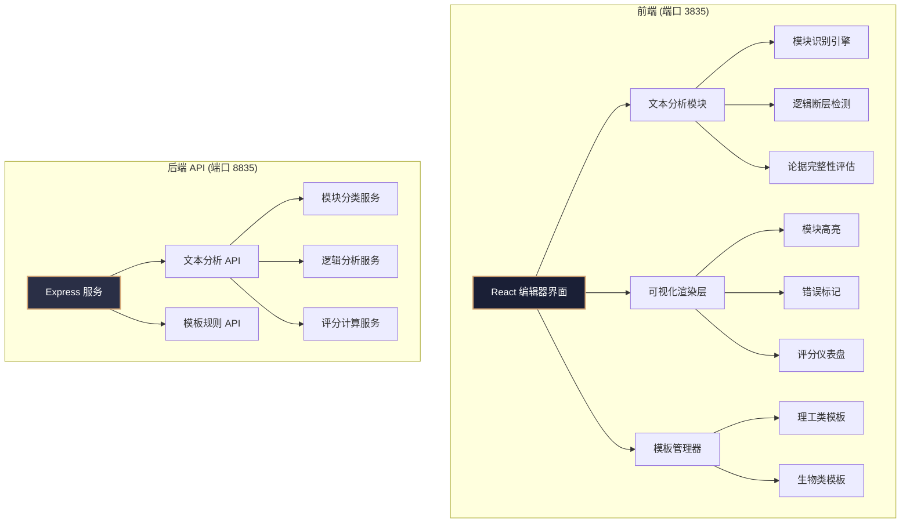

## 1. 架构设计



## 2. 技术说明

- **前端框架**: React@18 + TypeScript + Vite
- **前端样式**: TailwindCSS@3 + 自定义 CSS 变量（支持主题色系统）
- **状态管理**: React useState + useContext（轻量级，无需 Redux）
- **图标**: Lucide React
- **后端框架**: Express@4 + CORS
- **后端端口**: 8835
- **前端端口**: 3835 (Vite dev server)
- **数据存储**: LocalStorage（草稿自动保存），无需数据库

## 3. 路由定义

| 路由 | 用途 |
|------|------|
| / | 主编辑器页面，包含所有功能 |

## 4. API 定义

### 4.1 文本分析接口

```typescript
// 请求
interface AnalyzeRequest {
  text: string;
  template: 'engineering' | 'biology';
}

// 响应
interface AnalyzeResponse {
  modules: ModuleInfo[];
  logicGaps: LogicGap[];
  evidenceIssues: EvidenceIssue[];
  scores: ScoreData;
  suggestions: Suggestion[];
}

interface ModuleInfo {
  type: 'introduction' | 'experiment' | 'data' | 'conclusion';
  name: string;
  startIndex: number;
  endIndex: number;
  wordCount: number;
  completeness: number;
}

interface LogicGap {
  id: string;
  startIndex: number;
  endIndex: number;
  severity: 'high' | 'medium' | 'low';
  description: string;
  suggestion: string;
}

interface EvidenceIssue {
  id: string;
  startIndex: number;
  endIndex: number;
  type: 'missing_data' | 'weak_argument' | 'no_citation';
  description: string;
}

interface ScoreData {
  overall: number;
  moduleCompleteness: number;
  logicFlow: number;
  evidenceSufficiency: number;
}

interface Suggestion {
  id: string;
  module: string;
  priority: 'high' | 'medium' | 'low';
  title: string;
  description: string;
}
```

### 4.2 模板规则接口

```typescript
// GET /api/templates/:type
interface TemplateRule {
  moduleRequirements: {
    introduction: { minWords: number; keywords: string[] };
    experiment: { minWords: number; keywords: string[] };
    data: { minWords: number; keywords: string[] };
    conclusion: { minWords: number; keywords: string[] };
  };
  logicFlowRules: string[];
  evidenceRequirements: string[];
}
```

## 5. 前端组件结构

```
src/
├── components/
│   ├── Editor/
│   │   ├── TextEditor.tsx        # 主文本编辑器
│   │   ├── ModuleHighlighter.tsx # 模块高亮渲染
│   │   └── ErrorMarker.tsx       # 逻辑错误标记
│   ├── Sidebar/
│   │   ├── ScoreGauge.tsx        # 评分仪表盘
│   │   ├── ScoreBreakdown.tsx    # 分项评分条形图
│   │   ├── IssueList.tsx         # 问题列表面板
│   │   └── TemplateSwitcher.tsx  # 模板切换器
│   ├── Toolbar/
│   │   └── TopToolbar.tsx        # 顶部工具栏
│   └── common/
│       ├── ModuleTag.tsx         # 模块标签组件
│       └── PriorityBadge.tsx     # 优先级徽章
├── hooks/
│   ├── useTextAnalysis.ts        # 文本分析逻辑 Hook
│   └── useAutoSave.ts            # 自动保存 Hook
├── services/
│   └── analysisService.ts        # API 调用服务
├── utils/
│   ├── moduleDetector.ts         # 模块识别算法
│   ├── logicAnalyzer.ts          # 逻辑分析算法
│   └── scoreCalculator.ts        # 评分计算工具
├── templates/
│   ├── engineering.ts            # 理工类模板规则
│   └── biology.ts                # 生物类模板规则
├── types/
│   └── index.ts                  # TypeScript 类型定义
├── App.tsx
└── main.tsx
```

## 6. 核心算法设计

### 6.1 模块识别算法
基于关键词匹配 + 语义位置权重的混合识别：
- 扫描文本中的特征关键词（如"引言""绪论"→introduction，"实验方法""材料与方法"→experiment）
- 结合段落位置权重（开篇倾向绪论、结尾倾向结论）
- 输出四大模块的起止位置和完整度评分

### 6.2 逻辑断层检测
- 段落衔接词分析（缺失"因此""然而""综上所述"等过渡词标记潜在断层）
- 前后段落语义相似度计算（相似度骤降判定为逻辑跳跃）
- 论证链完整性检查（提出问题→实验→数据→结论的链路分析）

### 6.3 评分算法
加权综合评分：
- 模块完整性 (35%)：四大模块是否存在及字数达标情况
- 逻辑连贯性 (35%)：段落衔接流畅度、论证链完整度
- 论据充分度 (30%)：数据支撑、引用标记、证据密度

## 7. 开发服务器配置

- **Vite (前端)**: `vite --port 3835 --host`
- **Express (后端)**: `node server/index.js --port 8835`
- **CORS 配置**: 允许来自 `http://localhost:3835` 的请求
